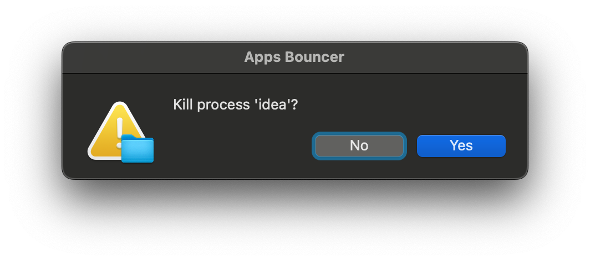

# Apps Bouncer

Application that keeps track of running processes,
snitching bad-behaving ones to the user, who can choose to kill them.

## Why

Imagine your Operating System is a pub where the processes it's running are the patrons.

`apps-bouncer` is like the bouncer who keeps the patrons in line.
When they misbehave, they're brought to the manager (the user) who can decide whether to kill them.
It's ok because killing processes is totally legal ;).

## Supported Platforms

Only MacOS if fully supported right now.

The Mac OS notifier is a popup window that looks like this:



On other Unixes, like Linux, the code should work, but the only notifier implementation is to print to the terminal.

On Windows and other OS's, a replacement for `ps` would be required, and a parser for the command output would be
also needed if it doesn't look like the `ps` output.

## Configuration

To configure the bouncer, provide a configuration file at one of these locations:

* `$HOME/.config/apps-bouncer/config.yaml`.
* `./apps-bouncer.yaml`.
* provide another path by passing it as an argument to `apps_bouncer`.

The configuration file looks as follows (all values are optional):

```yaml
# Period in seconds for sampling the OS processes (min: 1, max: 360, default: 2)
periodSeconds: 5

# Maximum samples a process may misbehave (i.e. be over the limits)
# (min: 1, max: 100, default: 4)
misbehavingChances: 5

# CPU % threshold (min: 1, max: 100, default: 50)
cpuThreshold: 75
  
# Memory % threshold (min: 1, max: 100, default: 25)
memoryThreshold: 50
  
# Post notification period in minutes (min: 1, max: 30 * 24 * 60, default: 60).
# During this period, the user won't be notified again about misbehaving processes.
postNotificationPeriodMinutes: 30

# Log level (log is sent to stdout).
# Can be one of 'finer', 'fine', 'info', 'warning', 'error'.
# The default is 'info'.
logLevel: warning
```

## Building

This project builds with [Dartle](https://renatoathaydes.github.io/dartle-website/).

To get Dartle:

```shell
dart pub global activate dartle
```

And then run `dartle` in the root directory to build and test the project.

To create the executable, run:

```shell
dartle compileExe
```

The executable is saved at `build/bin/apps_bouncer`.
